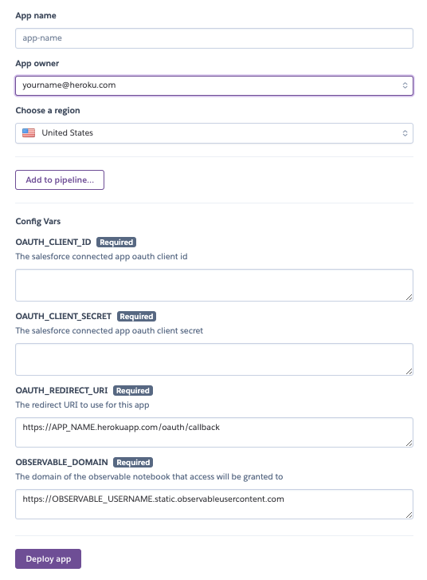

# observable-oauth-salesforce

A simple Oauth2 user flow for logging into salesforce and passing that to observablehq.

[Demo](https://observablehq.com/@paulroth3d/observable-salesforce-authentication)

# Setup

## Overview

There are just 4 steps needed, and can be done in 10 minutes or less.

(and most of that is just waiting)

1. Setup a Connected App to use for authentication in.
2. Allow CORS for your Observable Notebook.
2. Use the Heroku Button to implement the login flow
3. Create / Duplicate an Observable Notebook to use the login flow.

## Step 1 - Setup a Connected App

Within Salesforce, go to `setup > Apps > App Manager` to see the list of apps within your Salesforce environment.

Click the button to create a new `Connected App`

Use at least the following to specify your connected app, but as always - [please reference the help materials for more information](https://help.salesforce.com/articleView?err=1&id=sf.connected_app_create.htm&type=5)

<table>
    <tr>
        <th>What to Set</th>
        <th>Description</th>
        <th>Example</th>
    </tr>
    <tr>
        <td>Connected App Name</td>
        <td>Name of your connected app</td>
        <td>Observable Login</td>
    </tr>
    <tr>
        <td>API Name</td>
        <td>Unique code accessible name of the app</td>
        <td>Observable_Login</td>
    </tr>
    <tr>
        <td>Contact Email</td>
        <td>Email address for someone to contact with questions</td>
        <td>jdoe@example.com</td>
    </tr>
    <tr>
        <td>Enable OAuth Settiongs</td>
        <td>Allows for OAuth2 to be used</td>
        <td>MUST BE CHECKED</td>
    </tr>
    <tr>
        <td>Callback URL</td>
        <td>This will be the name of your heroku app + '.herokuapp.com/oauth/callback' at the end
        <td>https://my-observable-sfdc-login.herokuapp.com/oauth/callback</td>
    </tr>
    <tr>
        <td>Selected OAuth Scopes</td>
        <td>The information that can be accessed</td>
        <td>Access your basic information (id, profile, email, address, phone), Access and manage your data. (Although it is entirely up to you)</td>
    </tr>
</table>

### Keep window open for use

The connected app may take up to 10 minutes to be available.

Keep this window open, as we will refer to it in the Heroku Button.

## Step 2 - Setup CORS for your Observable Notebook

This allows your notebook to leverage the API.

Note that this will use your Observable Username, as we are only unlocking it for that particular user:

Under `Setup > Security > CORS`

Add a new entry with Origin URL of:

`https://OBSERVABLE-USERNAME.static.observableusercontent.com`

ex:

`https://mbostock.static.observableusercontent.com`

## Step 3 - Heroku Button to Create Instance

Click the following button to create a Heroku app

Note that a number of the fields that are provided are from the connected app used in step 1.

-----

-----

<table>
    <tr>
        <th>Item to Set</th>
        <th>Description</th>
        <th>Example</th>
    </tr>
    <tr>
        <td>App Name</td>
        <td>The name of your app</td>
        <td>my-observable-oauth</td>
    <tr>
        <td>OAUTH_CLIENT_ID</td>
        <td>The Consumer Key from the connected app</td>
        <td>3MVG..... [85 characters long]</td>
    </tr>
    <tr>
        <td>OAUTH_CLIENT_SECRET</td>
        <td>The Consumer Secret from the connected app</td>
        <td>512aDEF... [64 characters long]</td>
    </tr>
    <tr>
        <td>OAUTH_REDIRECT_URI</td>
        <td>Note this uses "App Name" defiend above</td>
        <td>https://my-observable-oauth.herokuapp.com/oauth/callback</td>
    </tr>
    <tr>
        <td>OBSERVABLE_DOMAIN</td>
        <td>The domain of the observable notebook. This uses your Observable username</td>
        <td>https://mbostock.static.observableusercontent.com</td>
    </tr>
</table>

### Click Deploy App Button

This will then show the log as the heroku app is deployed.

### NOTE: if you need to change these later

You can always find the app under heroku, and 'Reveal Config Vars' to see the existing values or changing them.

Changing the values will restart your dyno with those new values.

## Step 4 - Create an Observable Notebook

The simplest is simply to clone the example notebook here:

[https://observablehq.com/@paulroth3d/observable-salesforce-authentication](https://observablehq.com/@paulroth3d/observable-salesforce-authentication)

Alternatively, you only need the items in the cells above the horizontal line (the text says which cells)

Note that you can see all the commented source code used simply by clicking in the 'gutter' on the left of any cell.

# See more

* [Observable OAuth](https://talk.observablehq.com/t/best-practice-for-oauth-popup-prompts/684)
* [Observable Popup](https://observablehq.com/d/24e8315897f10fdb)